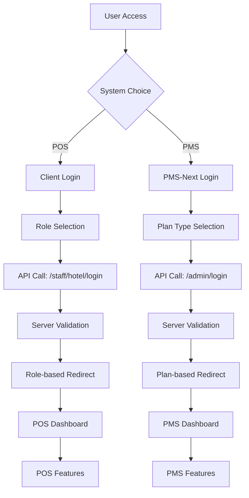

# Screens, Endpoints & Dashboard Access Relationship Analysis

## Overview

This document provides a comprehensive analysis of the relationship between screens, endpoints, and dashboard access across the **Client** (POS), **PMS-Next** (PMS), and **Server** (Backend) systems.

## System Architecture

### 🏗️ **Three-Tier Architecture**

```
┌─────────────────┐    ┌─────────────────┐    ┌─────────────────┐
│   CLIENT        │    │   PMS-NEXT      │    │   SERVER        │
│   (POS System)  │    │   (PMS System)  │    │   (Backend API) │
│                 │    │                 │    │                 │
│ • Role-based    │    │ • Plan-based    │    │ • Plan Access  │
│ • Staff Login   │    │ • Admin Login   │    │ • JWT Auth      │
│ • POS Focus     │    │ • PMS Focus     │    │ • Plan Control  │
└─────────────────┘    └─────────────────┘    └─────────────────┘
```

## 1. CLIENT (POS System) - Role-Based Authentication

### 📱 **Authentication Flow**
```
Login Screen → Role Selection → API Call → Dashboard Redirect
```

### 🔐 **Authentication Endpoints**
```typescript
// Admin Login (Hotel Admin)
POST /api/v1.0/admin/login
Body: { email, password, planType: 'pos' }

// Staff Login (Front Desk, Restaurant, Housekeeping)
POST /api/v1/staff/hotel/login
Body: { email, password }
```

### 👥 **User Roles & Dashboard Access**
| Role | Dashboard Route | Access Level | Features |
|------|----------------|--------------|----------|
| `hotel_admin` | `/manager_dashboard` | Full POS Access | Restaurant, Staff, Payments |
| `front_desk` | `/front_desk` | Guest Services | Check-in, Guest Management |
| `restaurant_manager` | `/restaurant_manager` | Restaurant Ops | Orders, Menu, Staff |
| `housekeeper` | `/housekeeper-dashboard` | Housekeeping | Room Status, Cleaning |

### 🛡️ **Middleware Protection**
```typescript
// Protected Routes
const protectedRoutes = [
  '/manager_dashboard',
  '/front_desk', 
  '/restaurant_manager',
  '/housekeeper-dashboard',
  '/scheck'
];

// Access Control Logic
if (user.role === 'hotel_admin') {
  if (!user.hotelId) → redirect to '/create-hotel'
  else → allow access to '/manager_dashboard'
}
```

### 📊 **Dashboard Screens**
```
/manager_dashboard     → Hotel Admin Dashboard
/front_desk           → Front Desk Operations
/restaurant_manager   → Restaurant Management
/housekeeper-dashboard → Housekeeping Operations
/scheck              → Room Status Check
```

## 2. PMS-NEXT (PMS System) - Plan-Based Authentication

### 🏨 **Authentication Flow**
```
Login Screen → Plan Type Selection → API Call → Dashboard Redirect
```

### 🔐 **Authentication Endpoints**
```typescript
// PMS Admin Login
POST /api/v1.0/admin/login
Body: { email, password, planType: 'pms' }
```

### 📋 **Plan Types & Access Control**
| Plan Type | Access Level | Features |
|-----------|--------------|----------|
| `pms` | PMS Only | Hotel Management, Bookings, Rooms |
| `pos` | POS Only | Restaurant, Payments, Staff |
| `bundle` | Both Systems | Full Access to PMS + POS |

### 🏢 **Dashboard Screens**
```
/manager_dashboard     → Hotel Management Dashboard
/business/create-hotel → Hotel Creation
/pricing/billing-summary → Plan Management
```

## 3. SERVER (Backend API) - Unified Authentication

### 🔧 **Authentication Controller**
```typescript
// Main Login Endpoint
POST /api/v1.0/admin/login
Body: { email, password, planType, recaptchaToken }

// Plan Access Validation
canAccessPlanType(planType: 'pms' | 'pos' | 'bundle'): boolean {
  // System admins can access everything
  if (this.role === AdminRole.SYSTEM_ADMIN) return true;
  
  // Bundle plan users can access both PMS and POS
  if (this.planType === 'bundle') return true;
  
  // POS plan users can access POS
  if (this.planType === 'pos' && planType === 'pos') return true;
  
  // PMS plan users can only access PMS
  if (this.planType === 'pms' && planType === 'pms') return true;
  
  // Additional access rules...
}
```

### 🎯 **Role-Based Access Matrix**
| User Role | PMS Access | POS Access | Admin Access |
|-----------|------------|------------|--------------|
| `system_admin` | ✅ Full | ✅ Full | ✅ Full |
| `hotel_admin` + `bundle` | ✅ Full | ✅ Full | ❌ |
| `hotel_admin` + `pms` | ✅ Full | ❌ | ❌ |
| `hotel_admin` + `pos` | ❌ | ✅ Full | ❌ |
| `front_desk` | ❌ | ✅ Limited | ❌ |
| `restaurant_manager` | ❌ | ✅ Limited | ❌ |
| `housekeeper` | ❌ | ✅ Limited | ❌ |

## 4. Authentication Flow Relationships

### 🔄 **Complete Authentication Flow**



### 🛠️ **Server Endpoint Mapping**

| Frontend | Endpoint | Purpose | Plan Type |
|----------|----------|---------|-----------|
| Client | `/api/v1.0/admin/login` | Hotel Admin Login | `pos` |
| Client | `/api/v1/staff/hotel/login` | Staff Login | N/A |
| PMS-Next | `/api/v1.0/admin/login` | PMS Admin Login | `pms` |
| Both | `/api/v1.0/admin/forgot-password` | Password Reset | N/A |
| Both | `/api/v1.0/admin/reset-password` | Password Reset Confirm | N/A |

## 5. Dashboard Access Patterns

### 🎯 **Access Control Logic**

#### **Client (POS) - Role-Based**
```typescript
// Role-based redirect mapping
const roleRedirectMapping = {
  restaurant_manager: "/restaurant_manager",
  hotel_admin: "/manager_dashboard", 
  housekeeper: "/housekeeper-dashboard",
  front_desk: "/front_desk"
};
```

#### **PMS-Next (PMS) - Plan-Based**
```typescript
// Plan-based redirect logic
if (response.data.data.hasHotel) {
  router.push("/manager_dashboard");
} else {
  router.push("/business/create-hotel");
}
```

#### **Server - Unified Validation**
```typescript
// Plan access validation
if (planType === 'pos') {
  if (administrator.planType === 'pms') {
    errorMessage = "Access denied. Your PMS plan does not include POS access. Please upgrade to a Bundle plan.";
  }
} else if (planType === 'pms') {
  if (administrator.planType === 'pos') {
    errorMessage = "Access denied. Your POS plan does not include full PMS access. Please upgrade to a Bundle plan.";
  }
}
```

## 6. Screen-to-Endpoint Mapping

### 📱 **Client Screens**
| Screen | Endpoint | Method | Purpose |
|--------|----------|--------|---------|
| `/` (Login) | `/api/v1.0/admin/login` | POST | Hotel Admin Login |
| `/` (Login) | `/api/v1/staff/hotel/login` | POST | Staff Login |
| `/manager_dashboard` | `/api/v1/admin/hotels/*` | GET/POST | Hotel Management |
| `/restaurant_manager` | `/api/v1/restaurant/*` | GET/POST | Restaurant Ops |
| `/front_desk` | `/api/v1/checkin/*` | GET/POST | Guest Services |
| `/housekeeper-dashboard` | `/api/v1/rooms/*` | GET/POST | Room Management |

### 🏨 **PMS-Next Screens**
| Screen | Endpoint | Method | Purpose |
|--------|----------|--------|---------|
| `/business/login` | `/api/v1.0/admin/login` | POST | PMS Admin Login |
| `/manager_dashboard` | `/api/v1/admin/hotels/*` | GET/POST | Hotel Management |
| `/business/create-hotel` | `/api/v1/admin/hotels` | POST | Hotel Creation |
| `/pricing/billing-summary` | `/api/v1/plans/*` | GET/POST | Plan Management |

### 🔧 **Server Endpoints**
| Endpoint | Method | Purpose | Access Control |
|----------|--------|---------|----------------|
| `/api/v1.0/admin/login` | POST | Admin Login | Plan Type Validation |
| `/api/v1/staff/hotel/login` | POST | Staff Login | Role Validation |
| `/api/v1/admin/hotels/*` | GET/POST | Hotel Management | Hotel Admin Only |
| `/api/v1/restaurant/*` | GET/POST | Restaurant Ops | Restaurant Manager |
| `/api/v1/checkin/*` | GET/POST | Guest Services | Front Desk |
| `/api/v1/rooms/*` | GET/POST | Room Management | Housekeeper |

## 7. Security & Access Control

### 🔒 **Authentication Layers**

#### **Layer 1: Frontend Authentication**
- Role/Plan selection
- Form validation
- reCAPTCHA verification

#### **Layer 2: API Authentication**
- JWT token validation
- Plan type verification
- Role-based access control

#### **Layer 3: Middleware Protection**
- Route protection
- Token validation
- Access level verification

### 🛡️ **Access Control Matrix**

| User Type | Client Access | PMS-Next Access | Server Access |
|-----------|---------------|-----------------|---------------|
| System Admin | ✅ Full | ✅ Full | ✅ Full |
| Hotel Admin + Bundle | ✅ Full | ✅ Full | ✅ Full |
| Hotel Admin + POS | ✅ Full | ❌ | ✅ POS Only |
| Hotel Admin + PMS | ❌ | ✅ Full | ✅ PMS Only |
| Front Desk | ✅ Limited | ❌ | ✅ Limited |
| Restaurant Manager | ✅ Limited | ❌ | ✅ Limited |
| Housekeeper | ✅ Limited | ❌ | ✅ Limited |

## 8. Data Flow & State Management

### 📊 **Authentication State Flow**

```
1. User Login → 2. API Validation → 3. Token Generation → 4. State Storage → 5. Dashboard Redirect
```

#### **Client State Management**
```typescript
// AuthUtils - Local Storage
localStorage.setItem("userData", JSON.stringify(userData));
localStorage.setItem("token", accessToken);
localStorage.setItem("hotelId", hotelId);
```

#### **PMS-Next State Management**
```typescript
// Enhanced Plan Storage
localStorage.setItem('userPlan', JSON.stringify(userPlan));
localStorage.setItem('trialDetails', JSON.stringify(trialDetails));
```

#### **Server State Management**
```typescript
// JWT Token Storage
res.cookie('accessToken', accessToken, { httpOnly: true });
res.cookie('refreshToken', refreshToken, { httpOnly: true });
```

## 9. Error Handling & Redirects

### ⚠️ **Error Scenarios**

#### **Access Denied Scenarios**
```typescript
// Plan Access Denied
if (planType === 'pos' && administrator.planType === 'pms') {
  errorMessage = "Access denied. Your PMS plan does not include POS access. Please upgrade to a Bundle plan.";
}

// Role Mismatch
if (selectedRole !== result.data.role) {
  errorMessage = "Selected role does not match your account role. Please select the correct role and try again.";
}
```

#### **Redirect Scenarios**
```typescript
// Hotel Admin without Hotel
if (user.role === 'hotel_admin' && !user.hotelId) {
  redirect to '/create-hotel'
}

// Restaurant Manager without Restaurant
if (user.role === 'restaurant_manager' && !user.restaurantId) {
  redirect to '/create-restaurant'
}
```

## 10. Integration Points

### 🔗 **Cross-System Integration**

#### **Shared Authentication**
- Same JWT tokens across systems
- Unified user database
- Consistent role definitions

#### **Plan-Based Access**
- Server validates plan access
- Frontend enforces plan restrictions
- Middleware protects routes

#### **State Synchronization**
- Shared localStorage keys
- Consistent cookie names
- Unified logout process

## 11. Future Enhancements

### 🚀 **Recommended Improvements**

#### **Unified Authentication**
- Single login interface
- Plan type selection
- Automatic system routing

#### **Enhanced Access Control**
- Granular permissions
- Feature-based access
- Dynamic role assignment

#### **Improved State Management**
- Centralized auth state
- Real-time synchronization
- Better error handling

---

## Summary

The relationship between screens, endpoints, and dashboard access follows a **three-tier architecture**:

1. **CLIENT (POS)**: Role-based authentication with staff-focused features
2. **PMS-NEXT (PMS)**: Plan-based authentication with hotel management features  
3. **SERVER (Backend)**: Unified authentication with plan and role validation

The system provides **flexible access control** through plan types (PMS, POS, Bundle) and user roles (Admin, Staff), ensuring users can only access features appropriate to their subscription and responsibilities.

**Key Integration Points:**
- Shared JWT authentication
- Plan-based access validation
- Role-based dashboard routing
- Unified error handling
- Consistent state management
